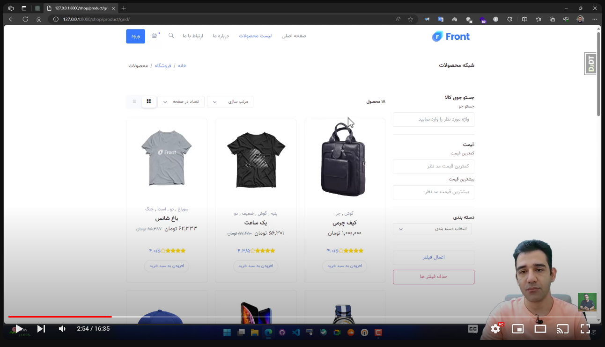
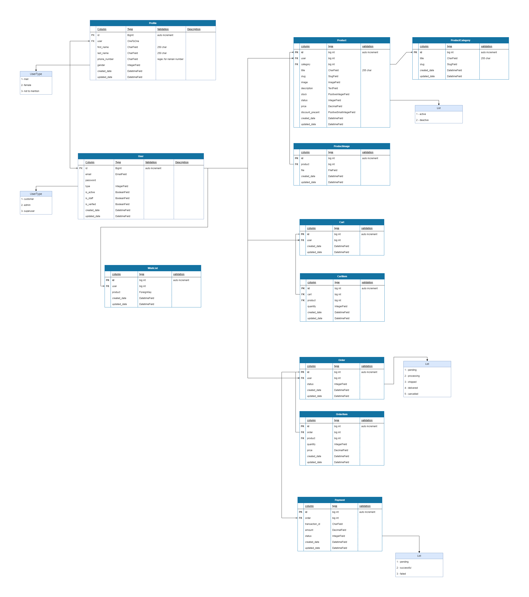

<h1 align="center">Django Shop Maktabkhooneh</h1>
<h3 align="center">A Sample shop for educational purposes and use for template </h3>

 
# Guideline
- [Guideline](#guideline)
- [Goal](#goal)
- [Demo](#demo)
- [Database Schema](#database-schema)
- [Curriculum](#curriculum)
- [License](#license)
- [Bugs](#bugs)

# Goal

This is a sample project to show you how to create a ecommerce website, and how to interact with users and payment gateway and also how to manage orders and products.

# Demo

the video will show you a demo of the project and what are the capabilities and what features are included.

# Database Schema

the provided schema is the main database design of the project based on the models we have used in django project.

# Curriculum

here are the course main curriculum

- introduction (phase 1)
- project setup
- authentication and authorization
- create shop and products
- manage and create cart
- users dashboard based and pages
- product and inventory management
- session and db management of cart
- order and total price calculation
- integration with payment gateway
- order management
- wishlist management
- review management
- next steps to learn (and know phase 2)

# License
MIT.

# Bugs
Feel free to let me know if something needs to be fixed. or even any features seems to be needed in this repo.
